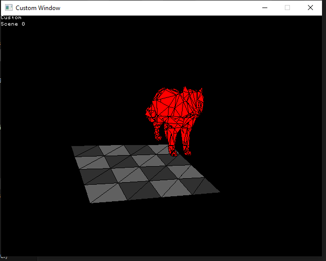
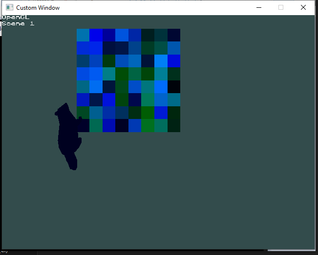
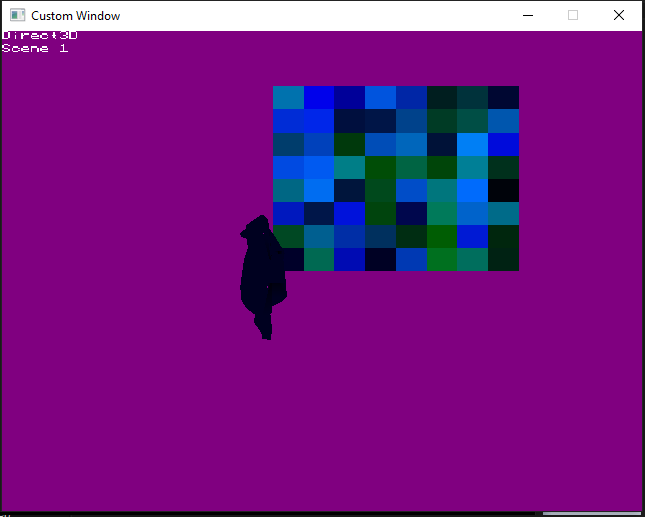

# WinAPIEngine
Foundation for custom C++ windows application that allows easily changing between different Graphics Libraries. Currently the application supports rendering 3d models and Strings using OpenGL, Direct3D 11, and a custom library designed for this application. Future versions of this application will support Vulkan and improve the current libraries to have more functions and be more optimal.

The application renders scenes which have a list of meshes, a moveable camera and a name. When the graphics library draws the scene, it renders it relative to the moveable camera (moveable using WASD and arrow keys). The name of the graphics library is also rendered as a string in the top left corner along with the name of the scene. The user can toggle between the scenes with the right mouse button and switch Graphics library with the left mouse button.

The OpenGL and Direct3D libraries are still work in progress and require optimization and clean up but they both work very similarly. They both have shaders for drawing meshes, which takes in the list of list of 3d vertices along with the vertices color and draws them in a position transformed by the camera's position and angle. They also have shaders for drawing textures in order to draw the Strings. The file Font.png contains all images for the renderable letters and draws a sub image of that file depending the strings characters. The shader discards any pixels that are the color 0xFF00FF in order to avoid alpha colors in the Font.png.

The custom Graphics library is also work in progress and requires optimization and requires optimization and clean up. It is a C++ copy of the library used in the project https://github.com/VadimEngine/Java3DEngine. Currently the library can only draw 3D meshes, strings and triangles but setting the colors of a BitMap and drawing that bitmap at the end of the render cycle. The library uses a z-Buffer array to store the z position of each color in order to draw closer shapes overlapping further away shapes. Future versions of this library will include textured meshes and to incorporate multi-threading and/or GPU processing to accelerate rendering.

The window that the application in drawn is a Win32 API window using the windows.h header. Events produces by the window are stored in key and mouse buffers that are using during each update in order to allow interacting with the application using keyboard and mouse

A scene drawn using the Custom Rendering library

A scene drawn using the OpenGL Rendering Library

A scene drawn using Direct3D Rendering Library
